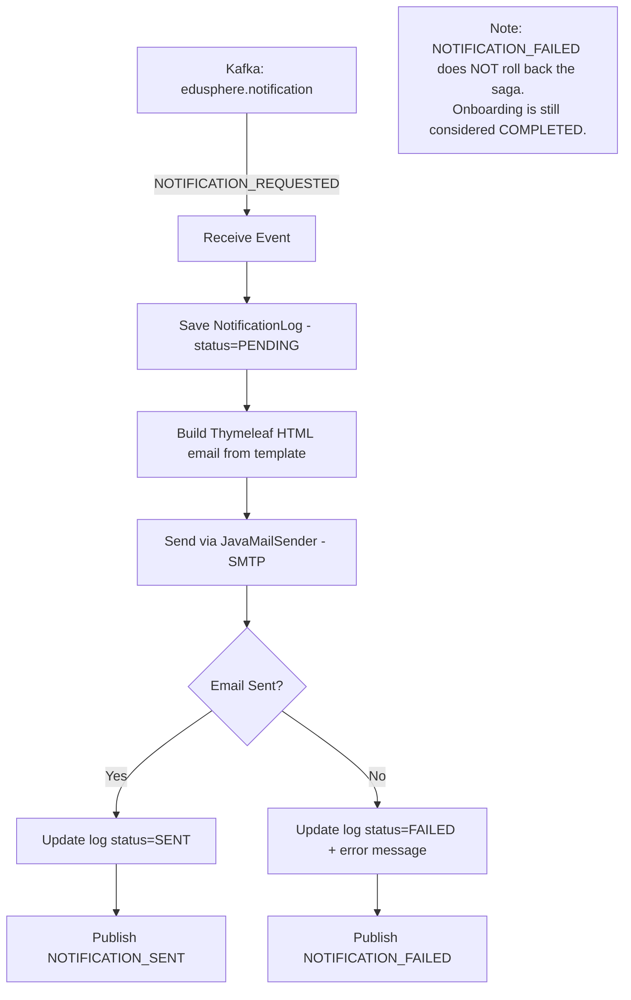

# Edusphere Notification Service

Sends welcome email notifications to newly onboarded tenant admins. Triggered via Kafka during the final step of the onboarding saga.

---

## Service Flow

---

## Email Template

A styled HTML welcome email (`welcome-email.html`) is sent with:

| Variable | Description |
|---|---|
| `recipientName` | Admin's full name |
| `institutionName` | School/institution name |
| `subdomain` | Assigned subdomain |
| `username` | Admin login username |
| `loginUrl` | `https://{subdomain}.edusphere.io/login` |

---

## Kafka Events

### Consumes from `edusphere.notification`

| Event Type | Payload Fields | Action |
|---|---|---|
| `NOTIFICATION_REQUESTED` | `recipientEmail`, `recipientName`, `institutionName`, `subdomain`, `username`, `tenantId` | Sends HTML welcome email via SMTP |

### Produces to `edusphere.notification`

| Event Type | Payload Fields | When Published |
|---|---|---|
| `NOTIFICATION_SENT` | `recipientEmail`, `notificationId` | Email delivered successfully |
| `NOTIFICATION_FAILED` | `reason`, `recipientEmail` | SMTP error or template error |

---

## No REST API

This service has no HTTP endpoints other than the actuator health check:

| Endpoint | Method | Description |
|---|---|---|
| `/actuator/health` | GET | Returns service health status |
| `/actuator/info` | GET | Returns service info |

---

## Database

**Database:** `edusphere_notification_db` (MySQL)

### Table: `notification_logs`

| Column | Type | Nullable | Default | Description |
|---|---|---|---|---|
| `id` | BIGINT (PK, AUTO_INCREMENT) | No | — | Primary key |
| `saga_id` | VARCHAR | No | — | Saga ID from onboarding |
| `recipient_email` | VARCHAR | No | — | Email address of recipient |
| `subject` | VARCHAR | No | — | Email subject line |
| `status` | VARCHAR | No | `PENDING` | `PENDING`, `SENT`, `FAILED` |
| `error_message` | VARCHAR(1000) | Yes | NULL | Error details if sending failed |
| `created_at` | DATETIME | No | — | Record creation time |
| `sent_at` | DATETIME | Yes | NULL | Actual send time |

---

## SMTP Configuration

The service uses Spring Mail (JavaMailSender). Configure for Gmail:

1. Enable **2-Factor Authentication** on the Gmail account
2. Generate an **App Password**: Google Account → Security → App Passwords
3. Use the app password (not your actual Gmail password) in `MAIL_PASSWORD`

---

## Configuration

| Environment Variable | Default | Description |
|---|---|---|
| `NOTIFICATION_SERVER_PORT` | `8095` | Service port |
| `NOTIFICATION_DB_URL` | `jdbc:mysql://localhost:3306/edusphere_notification_db` | MySQL URL |
| `NOTIFICATION_DB_USERNAME` | `notification_user` | DB username |
| `NOTIFICATION_DB_PASSWORD` | `notification_password` | DB password |
| `KAFKA_BOOTSTRAP_SERVERS` | `localhost:29092` | Kafka brokers |
| `MAIL_HOST` | `smtp.gmail.com` | SMTP server host |
| `MAIL_PORT` | `587` | SMTP port (TLS) |
| `MAIL_USERNAME` | `your-email@gmail.com` | Gmail address |
| `MAIL_PASSWORD` | `your-app-password` | Gmail App Password |
| `MAIL_FROM` | `noreply@edusphere.io` | From address in emails |
